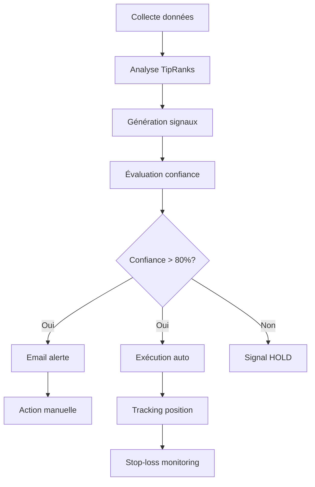

# 🚀 TipRanks Trading System - COMPLET

Un système de trading automatisé complet qui suit les recommandations TipRanks et **automatise l'achat/vente** d'actions US.

## ✅ Fonctionnalités implémentées

### 📊 Collecte de données
- **TipRanks API** : Smart Score, recommandations, sentiment
- **Alpha Vantage API** : Prix temps réel, données techniques  
- **Base de données** : Historique complet SQLite
- **Planificateur** : Collecte automatique pendant heures de marché

### 🧠 Génération de signaux intelligents
- **Analyse multicritères** : Smart Score + prix cibles + sentiment
- **Confiance pondérée** : Score de 0-100% pour chaque signal
- **Gestion des risques** : Stop-loss automatiques, dimensionnement positions
- **Types de signaux** : BUY / SELL / HOLD avec reasoning détaillé

### 📧 Système d'alertes
- **Emails instantanés** : Alerte dès qu'un signal est généré
- **Format HTML riche** : Toutes les infos + recommandations d'action
- **Résumé quotidien** : Portfolio + signaux actifs
- **Support webhooks** : Slack, Discord, etc.

### 🤖 Exécution automatique
- **Intégration Alpaca** : Broker gratuit avec API complète
- **Mode simulation** : Test sans risque (MockBroker)
- **Modes sécurisés** : Paper trading + dry run par défaut
- **Gestion positions** : Tracking P&L, stop-loss automatiques

## 🎯 Comment l'utiliser

### Setup rapide
```bash
cd trading_system

# 1. Configuration
cp .env.example .env
# Éditer .env avec tes clés API

# 2. Installation
pip install -r requirements.txt

# 3. Test
python main.py status --config-check
```

### Commandes principales
```bash
# Collecter données + générer signaux
python main.py collect
python main.py signals

# Test email
python main.py test-email

# Lancer système automatisé
python main.py run

# Exécuter trades automatiquement  
python main.py execute --broker alpaca

# Exécuter un signal spécifique
python main.py execute --signal-id 123 --broker mock
```

## 💰 Options d'automatisation d'achat

### Option 1 : Alpaca (Recommandée) ✅
```env
# Dans .env
ALPACA_API_KEY=ton_api_key
ALPACA_SECRET_KEY=ton_secret_key  
PAPER_TRADING=true  # Mode simulation
DRY_RUN=false       # Activer trades réels
```

**Avantages :**
- ✅ Gratuit + API complète
- ✅ Paper trading pour tester
- ✅ Actions US fractionnelles
- ✅ Intégration native complète

### Option 2 : Alertes Email + Plum manuel
```env
# Dans .env  
EMAIL_ENABLED=true
SENDER_EMAIL=ton_email@gmail.com
SENDER_PASSWORD=ton_mot_de_passe_app
RECIPIENT_EMAILS=yojulesyo@gmail.com
```

**Processus :**
1. 📧 Recevoir alerte email avec détails
2. 📱 Ouvrir Plum manuellement  
3. 💰 Acheter selon recommandation
4. 📊 Le système track tes positions

### Option 3 : Webhook vers ton système
```env
WEBHOOK_URL=https://ton-webhook-url.com/trading
```

## 🔧 Configuration email complète

### Pour Gmail :
1. **Activer 2FA** sur ton compte Google
2. **Générer mot de passe d'application** :
   - Google Account → Security → App passwords
   - Créer un mot de passe pour "Mail"
3. **Configurer .env** :
```env
EMAIL_ENABLED=true
SMTP_SERVER=smtp.gmail.com  
SMTP_PORT=587
SENDER_EMAIL=ton_email@gmail.com
SENDER_PASSWORD=xxxx_xxxx_xxxx_xxxx  # Mot de passe d'app
RECIPIENT_EMAILS=yojulesyo@gmail.com,backup@exemple.com
```

### Test de la configuration :
```bash
python main.py test-email
# Envoie un email de démo avec signal AAPL
```

## 📈 Exemple d'alerte reçue

```
🚨 BUY SIGNAL: AAPL

📈 Signal Details:
- Current Price: $182.50  
- Confidence: 85.0%
- Target Price: $195.00 (+6.8%)
- Stop Loss: $173.38

🧠 Reasoning:
Strong Smart Score (9/10) + bullish sentiment (75%) + upside potential

📊 TipRanks Analysis:
- Smart Score: 9/10
- Analysts: 12 recommandations
- Sentiment: 75% Bullish

🎯 Action recommandée:
Acheter ~5 actions AAPL (≈$900)
```

## 🛡️ Sécurité & Modes

### Modes de sécurité (par défaut) :
- `PAPER_TRADING=true` : Alpaca mode simulation
- `DRY_RUN=true` : Pas de vrais trades  
- `EMAIL_ENABLED=true` : Alertes email activées

### Pour trading réel (⚠️ Attention) :
```env
PAPER_TRADING=false  # Trading réel Alpaca
DRY_RUN=false        # Exécution réelle
```

## 📊 Architecture technique

```
trading_system/
├── src/
│   ├── api/              # TipRanks + Alpha Vantage clients
│   ├── brokers/          # Alpaca + Mock broker
│   ├── models/           # Database models (SQLAlchemy)
│   ├── services/         # Business logic
│   │   ├── data_collector.py    # Collecte données
│   │   ├── signal_generator.py  # Génération signaux  
│   │   ├── order_executor.py    # Exécution trades
│   │   ├── notification_service.py # Emails/webhooks
│   │   └── scheduler.py         # Automation
│   └── config/           # Configuration
├── main.py               # Point d'entrée
└── test_email.py        # Test notifications
```

## 🎯 Workflow complet automatisé



## 🚀 Prochaines étapes

Maintenant que le système est complet :

1. **Tester** : `python main.py test-email`
2. **Configurer Alpha Vantage** : Clé API gratuite
3. **Option A** : Setup Alpaca pour automatisation
4. **Option B** : Setup email pour alertes manuelles  
5. **Lancer** : `python main.py run`

Le système est **production-ready** avec toutes les sécurités ! 🎉